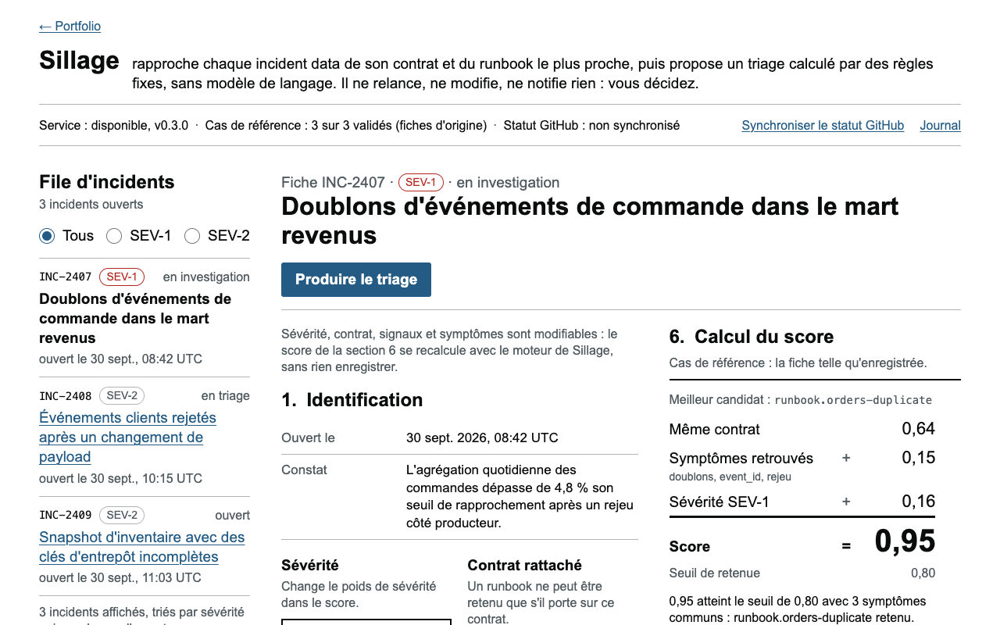

# Sillage

Sillage relie un incident data à son contrat de données, au runbook pertinent et aux signaux observés, puis propose un triage qu'une personne accepte, conteste ou rejette. Le moteur est déterministe : il n'appelle aucun modèle de langage et fonctionne sans clé d'API.

Sillage ne relance aucune donnée, ne modifie ni contrôle qualité ni contrat et ne notifie personne. La décision reste à l'équipe responsable.



La capture montre la fiche INC-2407 à l'ouverture : le score est posé comme une addition, contrat 0,64 + symptômes 0,15 + sévérité 0,16 = 0,95 pour un seuil de 0,80. On peut changer la sévérité, le contrat rattaché ou la valeur d'un signal, écarter un signal ou un symptôme : le moteur recalcule l'addition terme par terme, le runbook retenu peut changer, et sous le seuil (ou sans symptôme commun) Sillage s'abstient avec `INSUFFICIENT_EVIDENCE`. Ce scénario n'est ni enregistré ni partagé ; « Réinitialiser » revient à la fiche d'origine. Le triage et la décision humaine (accepter, demander des éléments, rejeter) portent toujours sur la fiche enregistrée.

## Pourquoi

Un incident data est rarement difficile faute d'information. L'information est dispersée entre le contrat, le runbook, les signaux de supervision et le contexte de l'équipe. Sillage les réunit dans une seule trace de décision :

```text
incident + signaux observés
          |
          v
contrat et runbook retrouvés
          |
          v
proposition appuyée sur des éléments cités
          |
          v
décision humaine et journal local
```

## Ce qui fonctionne

- Une API FastAPI et une page en forme de fiche d'incident : file d'incidents, puis identification, signaux observés, contrat, contrôles, consommateurs, triage proposé et décision, dans cet ordre.
- Un routage par score de correspondance calculé et affiché (voir plus bas), avec abstention explicite (`INSUFFICIENT_EVIDENCE`) quand aucun runbook n'atteint le seuil.
- Une décision humaine enregistrée comme reçu (accepté, éléments demandés, rejeté) dans un journal SQLite chaîné par empreintes ; aucune revue ne déclenche d'action. Sur l'instance publique, chaque onglet a son propre journal (en-tête `X-Sillage-Session`), effacé au bout d'une heure ; la note de revue n'est jamais stockée, le reçu n'en garde que l'empreinte SHA-256 et la longueur.
- Trois cas de référence hors ligne, exécutés par la CI, qui vérifient le runbook retenu, la décision, la complétude de la provenance et l'absence d'action automatique.

Le statut public de GitHub peut être lu à la demande ; il est informatif et n'influence jamais le triage.

## Le score de correspondance

Pour chaque runbook actif, le moteur additionne 0,64 si le runbook porte sur le même contrat que l'incident, jusqu'à 0,20 selon la part de ses symptômes retrouvés dans le texte de l'incident, et jusqu'à 0,16 selon la sévérité (0,16 pour SEV-1, 0,115 pour SEV-2, 0,072 pour SEV-3). Un runbook n'est retenu qu'à partir de 0,80 et avec au moins un symptôme commun. Le rapport expose ce score (`match_score`) et ses composantes ; ce n'est pas une probabilité.

La synthèse affichée sous le triage est produite par des règles fixes dans `src/sillage/narrative.py`. Ce module définit aussi une interface pour un éventuel fournisseur de texte, qui ne recevrait que les éléments retrouvés et devrait citer des identifiants vérifiables ; aucun n'est branché. Détails dans [docs/guardrails.md](docs/guardrails.md).

## Lancer en local

Python 3.11 ou plus récent.

```bash
python3 -m venv .venv
.venv/bin/pip install -e ".[dev]"
PYTHONPATH=src .venv/bin/python -m unittest discover -s tests -v
.venv/bin/uvicorn sillage.app:app --app-dir src --reload
```

La page est sur [http://localhost:8000](http://localhost:8000), le contrat OpenAPI sur [http://localhost:8000/docs](http://localhost:8000/docs).

Avec Docker :

```bash
docker build -t sillage-ai .
docker run --rm -p 10000:10000 -e PORT=10000 sillage-ai
```

## API

| Méthode | Chemin | Rôle |
| --- | --- | --- |
| `GET` | `/api/health` | Disponibilité et état du registre |
| `GET` | `/api/incidents` | File d'incidents |
| `GET` | `/api/incidents/{id}` | Incident et contrat qui le gouverne |
| `POST` | `/api/incidents/{id}/analyze` | Triage, sans action corrective |
| `POST` | `/api/incidents/{id}/simulate` | Recalcule le score sur une fiche modifiée ; n'écrit rien |
| `POST` | `/api/incidents/{id}/reviews` | Enregistre une décision humaine, n'exécute rien |
| `GET` | `/api/incidents/{id}/reviews` | Reçus de revue d'un incident |
| `GET` | `/api/contracts` | Catalogue des contrats de données |
| `GET` | `/api/audit` | Derniers événements du journal de la session |
| `GET` | `/api/evaluation` | Cas de référence hors ligne |
| `POST` | `/api/sources/github-status/sync` | Statut public GitHub, facultatif |

Chaque réponse porte un en-tête `X-Request-ID` pour relier une observation à une requête.

La simulation est sans état : les modifications du visiteur voyagent avec chaque requête et ne sont jamais stockées, si bien qu'un visiteur ne voit jamais le scénario d'un autre sur l'instance publique. Le corps est limité à 16 Ko, chaque valeur à 200 caractères, et le débit à 90 recalculs par minute et par adresse. Triage, décision et synchronisation sont limités à 30 par minute et par adresse ; l'adresse est lue dans `True-Client-IP`, sinon dans la valeur la plus à droite de `X-Forwarded-For`.

## Comment un triage est construit

1. Le service valide le registre local, puis résout la version du contrat référencée par l'incident.
2. Il classe les runbooks actifs par score de correspondance.
3. Il s'abstient si le meilleur candidat n'atteint pas le seuil ou ne partage aucun symptôme.
4. Il présente ensemble la décision, l'état du contrôle, les consommateurs touchés et les éléments bruts.
5. Il émet un reçu de provenance : versions, snapshots sources, identifiant de trace et empreinte des éléments.
6. Une personne accepte, demande des éléments ou rejette ; ce jugement devient un autre reçu du journal.

## Organisation du dépôt

```text
data/                  Contrats, incidents, runbooks et cas de référence (fictifs)
src/sillage/           Application FastAPI et moteur de triage
static/                Page de triage
tests/                 Tests hors ligne : API, journal, routage, sources
docs/                  Notes produit, architecture et exploitation (en anglais)
render.yaml            Blueprint Render
```

## Déploiement et limites

[render.yaml](render.yaml) déploie l'image Docker comme service web Render et surveille `/api/health`. La base SQLite locale et son chaînage par empreintes sont des mécanismes de démonstration, pas un registre immuable. En production multi-instance, il faudrait un stockage d'audit géré, une identité vérifiée, une politique de rétention, des permissions par rôle et un index de recherche gouverné. Les trois cas de référence protègent contre une régression sur ces scénarios ; ils ne mesurent pas la qualité du triage en général.

## Documentation

- [Fiche produit](docs/product-brief.md)
- [Note de travail](docs/working-paper.md)
- [Architecture](docs/architecture.md)
- [Modèle d'exploitation](docs/operating-model.md)
- [Garde-fous et évaluation](docs/guardrails.md)

## Licence

MIT
